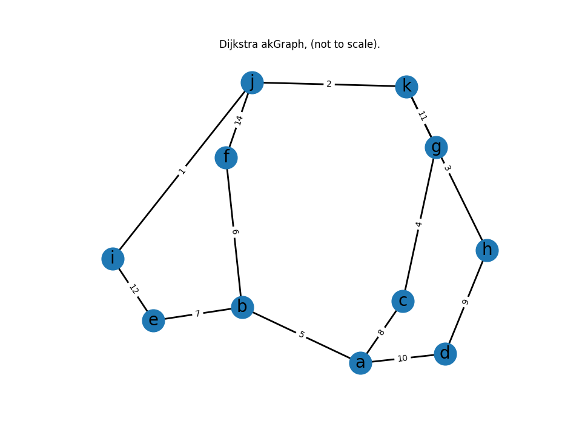
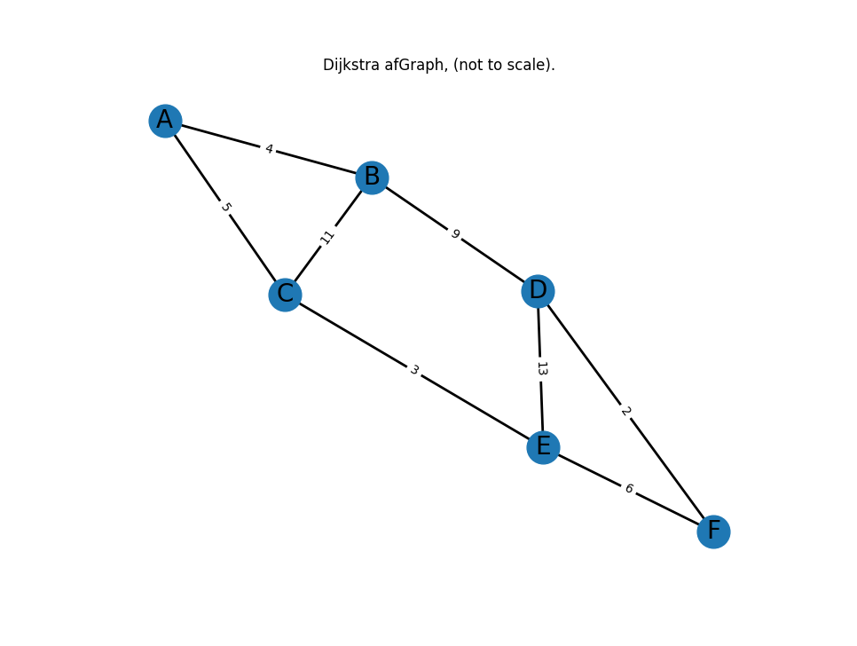

# Dijkstra
 A take on the world  famous "🇬🇧 [Dijkstra Algoritm](https://en.wikipedia.org/wiki/Dijkstra's_algorithm)" || 🇳🇱 "[Dijkstra's kortstepadalgoritme](https://nl.wikipedia.org/wiki/Kortstepad-algoritme)"


```python
def dijkstra(graph, start, goal):
    univisited = {n: float('inf') for n in graph.keys()}
    univisited[start] = 0
    visited = {}
    revPath = {}  # reversed path, used to reconstruct the shortest path

    while univisited:
        minNode = min(univisited, key=univisited.get)  # select the node with the smallest distance
        visited[minNode] = univisited[minNode]  # add it to the visited nodes

        if minNode == goal:
            break  # break the loop if the goal node is reached

        for neighbor in graph.get(minNode):  # update the distance to neighbors
            if neighbor in visited:
                continue  # skip if already visited
            tempDist = univisited[minNode] + graph[minNode][neighbor]  # calculate distance
            if tempDist < univisited[neighbor]:  # update if a shorter path is found
                univisited[neighbor] = tempDist  # update the shortest path to the neighbor
                revPath[neighbor] = minNode  # update the reversed path to the neighbor

        univisited.pop(minNode)  # remove the node from the unvisited nodes

    node = goal
    revPathList = [node]  # list to store the path in reverse order
    while node != start:
        node = revPath[node]
        revPathList.append(node)

    fwdPathList = revPathList[::-1]  # reverse the path to get the correct order
    fwdPath = ' --> '.join(fwdPathList)  # join the nodes with spaces
    return fwdPath, visited[goal]  # return the shortest path and its distance


# ----------------------------------------------------------------
# SETUP GRAPH

myGraph = {
    '1': {'2': 7, '3': 9, '6': 14},  # a
    '2': {'1': 7, '3': 10, '4': 15},
    '3': {'1': 9, '2': 10, '4': 11, '6': 2},
    '4': {'2': 15, '3': 11, '5': 6},
    '5': {'4': 6, '6': 9},  # b
    '6': {'1': 14, '3': 2, '5': 9}
}

akGraph = {
    'a': {'b': 5, 'c': 8, 'd': 10},
    'b': {'a': 5, 'e': 7, 'f': 6},
    'c': {'a': 8, 'g': 4},
    'd': {'a': 10, 'h': 9},
    'e': {'b': 7, 'i': 12},
    'f': {'b': 6, 'j': 14},
    'g': {'c': 4, 'k': 11},
    'h': {'d': 9, 'k': 3},
    'i': {'e': 12, 'j': 1},
    'j': {'f': 14, 'i': 1, 'k': 2},
    'k': {'g': 11, 'h': 3, 'j': 2}
} # Graph with Node with letters

afGraph = {
    'A':{'B':4, 'C':5},
    'B':{'C':11, 'A':4},
    'C':{'A':5, 'B':11, 'E':3},
    'D':{'B':9, 'E':13, 'F':2},
    'E':{'D':13, 'C':3, 'F':6},	
    'F':{'D':2, 'E':6}
}
#----------------------------------------------------------------
# SETUP NODES
startNode = '1'  # a
goalNode = '5'  # b

# startNode = 'a'  
# goalNode = 'j'  

path, minDistance = dijkstra(myGraph, startNode, goalNode)
print(f'The shortest distance from {startNode} to {goalNode} is: {minDistance}, along the path: {path}.')
```
## Output:

```
# myGraph
The shortest distance from 1 to 5 is: 20, along the path: 1 --> 3 --> 6 --> 5.

# akGraph
The shortest distance from a to j is 24, along the path: a --> d --> h --> k --> j.

# afGraph
The shortest distance from A to F is 14, along the path: A --> C --> E --> F
```

### akGraph visualised



### afGraph visualised


